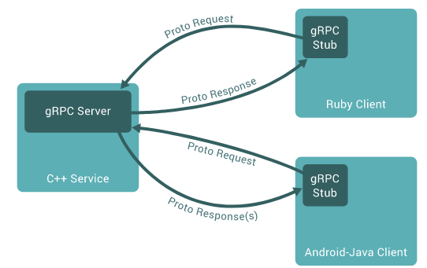
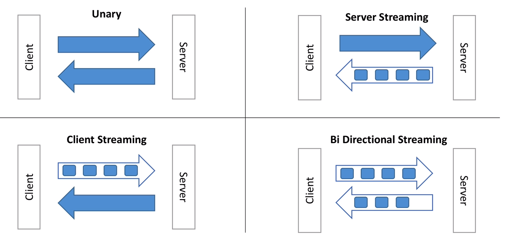

# Learning gRPC
gRPC is a free and open-source framework developed by Google. It is part of CNCF (Cloud Native Computation Foundation). Allows you to define Request and Response for RPC (Remote Procedure Calls).

It is modern, fast and efficient, build on top of HTTP/2, low latency, supports streaming, language independent, and makes it easy to plug in authentication, load balancing, logging and monitoring.

## RPC
RPC is a Remote Procedure Call. In the `Client` code, it looks like you are just calling a function directly on `Server`. 

It's not a new concept. gRPC makes cleanly and solves a lot of problems


## Protobuffer
gRPC is RPC with protobuffer or Protocol Buffer. 
- Is language agnostic
- Code can be generated for pretty much any language
- Data is binary and efficiently serialized, with small payloads.
- Very convenient for transporting a lot of data
- it allows for easy API evolution using rules

Defines Messages (data, requests and Responses) and Services (Service name and RPC endpoints)

## Types of API
4 types:
- Unary: Classic request and response. It is like http rest.
- Server Streaming: Using streaming for server send the response.
- Client Streaming: Using Streaming to send message for server, that response only once.
- Bi Directional Streaming: Using streams to send and received. 



#### Defining services
```proto
service GreetService{ 
  // Unary
  rpc Greet(GreetRequest) returns (GreetResponse) {};

  // Streaming Server
  rpc GreetManyTimes(GreetManyTimesRequest) returns (stream GreetManyTimesResponse) {};

  // Streaming Client
  rpc LongGreet(stream LongGreetRequest) returns (LongGreetResponse) {};

  // Bi Directional Streaming
  rpc GreetEveryone(stream GreetEveryoneRequest) returns (stream GreetEveryoneResponse) {};
}
```

## Scalabitity
- gRPC Servers are asynchronous by default; They do not block threads on request
- Each gRPC server can serve millions of requests in parallel
- gRPC clients can be asynchronous or synchronous
- gRPC clients can perform client side load balancing

## Security in gRPC
- gRPC suggests strongly to use SSL
- In production, all gRPC call sould be encrypted
- Using interceptors, we can also provide authentication

Instructions to create appropiate certificates for SSL:
```sh
#!/bin/bash
# Inspired from: https://github.com/grpc/grpc-java/tree/master/examples#generating-self-signed-certificates-for-use-with-grpc

# Output files
# ca.key: Certificate Authority private key file (this shouldn't be shared in real-life)
# ca.crt: Certificate Authority trust certificate (this should be shared with users in real-life)
# server.key: Server private key, password protected (this shouldn't be shared)
# server.csr: Server certificate signing request (this should be shared with the CA owner)
# server.crt: Server certificate signed by the CA (this would be sent back by the CA owner) - keep on server
# server.pem: Conversion of server.key into a format gRPC likes (this shouldn't be shared)

# Summary 
# Private files: ca.key, server.key, server.pem, server.crt
# "Share" files: ca.crt (needed by the client), server.csr (needed by the CA)

# Changes these CN's to match your hosts in your environment if needed.
SERVER_CN=localhost

# Step 1: Generate Certificate Authority + Trust Certificate (ca.crt)
openssl genrsa -passout pass:1111 -des3 -out ca.key 4096
openssl req -passin pass:1111 -new -x509 -days 365 -key ca.key -out ca.crt -subj "/CN=${SERVER_CN}"

# Step 2: Generate the Server Private Key (server.key)
openssl genrsa -passout pass:1111 -des3 -out server.key 4096

# Step 3: Get a certificate signing request from the CA (server.csr)
openssl req -passin pass:1111 -new -key server.key -out server.csr -subj "/CN=${SERVER_CN}"

# Step 4: Sign the certificate with the CA we created (it's called self signing) - server.crt
openssl x509 -req -passin pass:1111 -days 365 -in server.csr -CA ca.crt -CAkey ca.key -set_serial 01 -out server.crt 

# Step 5: Convert the server certificate to .pem format (server.pem) - usable by gRPC
openssl pkcs8 -topk8 -nocrypt -passin pass:1111 -in server.key -out server.pem
```

## Others
- gRPC uses onError to send errors from server to client. (https://grpc.io/docs/guides/error/)
- It is recomended set a deadline for all client RPC calls (https://grpc.io/blog/deadlines/)

## About channel
Channel is an abstract over a connection and represents the connection. Connection creation is lazy and established during the first RPC. 

1 channel/connection for client/server is enough, event for concurrent requests. You can create more channels but not really required. (Channel creation is an expensive process)

For LoadBalance on client side we use subchannel, representing connections between client and server instances. We have two strategies, first instance available (default) and Round Robin

## Server executors
We have three options for configure threads executors. 
- CachedThreadPool: The default, that use from jetty threadpool
- DirectExecutor: Event loop, better for non-blocking apps
- FixedThreadPool: Open configuration, allow you to decide the number of thread

```kotlin
    val server = ServerBuilder.forPort(50055)
        // .directExecutor()  // option for event loop
        // .executor(Executors.newFixedThreadPool(20)) // Fixed number
        .intercept(AuthInterceptor())
        .addService(GreetServiceImpl())
        .build()
```

---
## References

- https://grpc.io/
- https://github.com/grpc/grpc-java
- https://www.udemy.com/course/grpc-java
- https://www.udemy.com/course/grpc-the-complete-guide-for-java-developers
- https://github.com/uw-labs/bloomrpc
- https://yidongnan.github.io/grpc-spring-boot-starter/en/